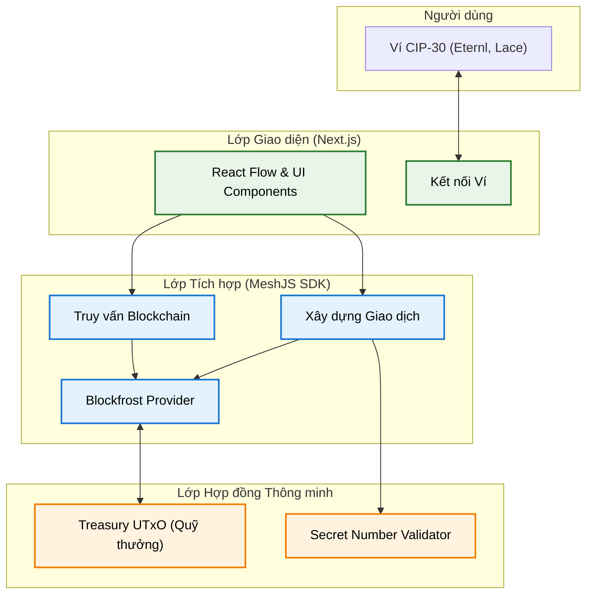

# Kiến trúc Tổng thể (System Architecture)

Tài liệu này cung cấp cái nhìn toàn cảnh về cấu trúc và các luồng tương tác của dự án Secret Number dApp trên mạng lưới Cardano.

## 1. Sơ đồ Kiến trúc Mức cao (High-Level Architecture)

Hệ thống được thiết kế theo mô hình 3 lớp phân tách rõ ràng:

1. **Lớp Giao diện (Frontend - Next.js)**: Nơi người dùng đối mặt tương tác. Xử lý hiển thị, kết nối ví và yêu cầu chữ ký.
2. **Lớp Tích hợp (Offchain - MeshJS)**: Thư viện TypeScript đóng vai trò làm cầu nối (SDK), xây dựng giao dịch (Transaction Builder) và truy vấn dữ liệu từ blockchain.
3. **Lớp Hợp đồng thông minh (Onchain - Aiken)**: Nơi chứa logic cốt lõi và các quy tắc đồng thuận mạng lưới để bảo vệ Quỹ thưởng (Treasury).

## 2. Chi tiết các Thành phần (Core Components)

### 2.1. Frontend (`/frontend`)
- **Framework**: Next.js (App Router) với React 18+.
- **Styling**: TailwindCSS kết hợp cùng Framer Motion cho các hiệu ứng hoạt ảnh (micro-animations) tạo trải nghiệm Glassmorphism hiện đại.
- **Trách nhiệm**:
  - Quản lý trạng thái kết nối ví người dùng (CIP-30) thông qua `@meshsdk/wallet`.
  - Thu thập input dự đoán (`guess`) và số bí mật mới (`new_secret`).
  - Hiển thị phản hồi UI theo thời gian thực (Trạng thái giao dịch, Cảnh báo Quỹ cạn, Skeleton Loaders).

### 2.2. Offchain Library (`/offchain`)
- **Công nghệ**: TypeScript, MeshJS.
- **Data Provider**: Blockfrost (thông qua `BlockfrostProvider`).
- **Nhiệm vụ**:
  - `queries.ts`: Truy vấn Game UTxO tại địa chỉ Script (`SCRIPT_ADDRESS`). Lọc các UTxO có datum hợp lệ và chọn ra UTxO có số dư lớn nhất.
  - `transactions.ts`: Xây dựng giao dịch (`MeshTxBuilder`). Khai báo UTxO đầu vào, định nghĩa Redeemer, và thiết lập UTxO đầu ra (`continuing output`) sao cho thỏa mãn điều kiện nghiêm ngặt của Smart Contract.
  - Phân tách logic mạng lưới ra khỏi mã nguồn UI, cho phép tái sử dụng SDK ở các môi trường khác (như CLI, backend).

### 2.3. Smart Contract (`/onchain`)
- **Ngôn ngữ**: Aiken (biên dịch ra UPLC - Plutus V3).
- **Trách nhiệm**: Thực thi luật chơi một cách tự động và minh bạch — mọi lượt chơi đều phải tuân thủ đúng quy tắc, không có ngoại lệ.
  - Xác thực lời giải của người chơi khớp với số bí mật đang được lưu giữ.
  - Đảm bảo người thắng chỉ nhận đúng **10 ADA** từ quỹ thưởng, phần còn lại bắt buộc phải được hoàn trả về hợp đồng.
  - Yêu cầu người thắng chỉ định số bí mật mới hợp lệ để trò chơi tiếp tục.

## 3. Luồng Dữ liệu (Data Flow) & Tương tác

1. **Khởi tạo Game (Deployment)**: 
   - Admin chạy script `deploy.ts` để nạp ADA vào Script Address với Datum chứa con số bí mật ban đầu.
2. **Truy vấn Trạng thái (Querying)**: 
   - Khi UX load, Frontend gọi `getGameContractUtxo()`.
   - Blockfrost quét địa chỉ Script, Offchain tính toán số dư kho bạc và trích xuất Datum CBOR.
3. **Thực thi Giao dịch (Execution)**:
   - Tham gia: Người chơi nhập số dự đoán và số bí mật mới.
   - Build Tx: `buildGuessTransaction()` lấy Game UTxO làm Input, cấu trúc Redeemer chứa số dự đoán, Datum chứa số bí mật mới, rồi tạo Output trả lại cho Script với Datum mới.
   - Ký Tx: Ví người dùng ký giao dịch.
   - Submit: Giao dịch được đẩy lên mạng Cardano. Nếu đáp án đúng, Quỹ thưởng sẽ bị trừ 10 ADA chuyển cho người chơi. Nếu sai, giao dịch thất bại.
