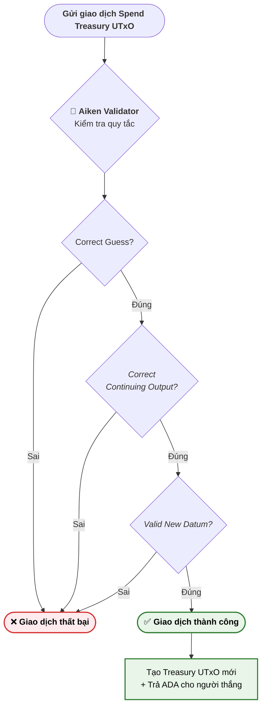

# Kiến trúc Smart Contract (Smart Contract Architecture)

Dapp Secret Number hoạt động dựa trên mô hình eUTxO (Extended Unspent Transaction Output) của Cardano. Thay vì lưu trữ trạng thái toàn cục (global state) dạng Account như Ethereum, Cardano chuyển đổi trạng thái cục bộ cho mỗi giao dịch.

## 1. Continuing Output Pattern

Đây là pattern phổ biến trên Cardano để xử lý trạng thái của các dApp (State Threading) trên nền tảng eUTxO.

- **Vấn đề**: UTxO trên Cardano chỉ có thể được tiêu thụ (spend) một lần. Khi quỹ thưởng (Treasury) bị tiêu thụ để trả ADA cho người chiến thắng, phần tiền thừa và trạng thái game sẽ mất đi nếu không có quy định rõ ràng.
- **Giải pháp**: Smart Contract ép buộc giao dịch phải tạo ra một UTxO mới (Output) gửi lại chính địa chỉ của Contract (gọi là Continuing Output). 
- **Triển khai trong Aiken**:
  ```aiken
  let continuing_outputs =
    transaction.outputs
      |> list.filter(fn(output) { output.address == own_address })
  
  expect [continuing_output] = continuing_outputs
  let correct_continuing_output = 
    output_lovelace == input_lovelace - reward_amount_lovelace
  ```
  Nhờ pattern này, quỹ Treasury có thể tồn tại liên tục, phục vụ nhiều lượt chơi nối tiếp nhau.

## 2. Thành phần Dữ liệu (State & Actions)

### 2.1. Datum (Trạng thái UTxO)
`Datum` là một mảnh dữ liệu đi kèm với UTxO, đại diện cho "trạng thái" của hợp đồng. Trong Secret Number, trạng thái duy nhất cần lưu trữ chính là con số bí mật hiện tại.
```aiken
pub type Datum {
  /// Dữ liệu lưu trữ trên UTxO: chứa con số bí mật
  secret: Int,
}
```

### 2.2. Redeemer (Input Hành động)
`Redeemer` là dữ liệu do người khởi tạo giao dịch (người chơi) đính kèm khi họ muốn tiêu thụ (spend) UTxO. Nó đại diện cho hành động "Tôi dự đoán con số này".
```aiken
pub type Redeemer {
  guess: Int,
}
```

## 3. Logic của Validator

Trọng tâm của Smart Contract nằm ở khối lệnh `spend`. Bất cứ khi nào ai đó muốn mở khóa (spend) UTxO chứa tiền thưởng, giao dịch mở khóa phải chứng minh nó thỏa mãn **3 điều kiện**.



### Điều kiện 1: Đoán đúng (Correct Guess)
```aiken
let correct_guess = redeemer.guess == own_datum.secret
```
Hợp đồng kiểm tra trực tiếp số đoán của người chơi (`redeemer.guess`) có khớp với số bí mật thực tế đang được giấu bên trong quỹ (`own_datum.secret`). Nếu sai, giao dịch thất bại ngay lập tức.

### Điều kiện 2: Trả lại đúng số dư quỹ thừa (Correct Continuing Output)
Mỗi lần có người đoán đúng, **10 ADA** được trả về cho người thắng. Hợp đồng đảm bảo phần còn lại được hoàn trả đầy đủ về quỹ thưởng — không ai có thể rút vượt quá số tiền quy định.
```aiken
let correct_continuing_output = 
  output_lovelace == input_lovelace - reward_amount_lovelace
```
Quy tắc: Giao dịch bắt buộc phải tạo ra một Output trả về chính hợp đồng, và lượng ADA bên trong đó phải bằng đúng tổng lượng ADA ban đầu trừ đi 10 ADA. Nhờ vậy, người chơi không thể lấy thêm bất kỳ số tiền nào ngoài 10 ADA.

### Điều kiện 3: Số bí mật mới phải hợp lệ (Valid New Datum)
Người chơi thắng cuộc sẽ có quyền "đặt lại" một con số bí mật mới để người kế tiếp tới giải, giúp cho trò chơi có thể tiếp diễn liên tục.
- Số bí mật mới phải là số nguyên (Datum dạng inline với kiểu dữ liệu `Datum {secret: Int}`):
```aiken
expect InlineDatum(datum_data) = continuing_output.datum
expect new_datum: Datum = datum_data
```
- Số bí mật mới phải nằm trong khoảng cho phép, trong dApp demo này là `[1, 999_999]`:
```aiken
let valid_new_datum =
  new_datum.secret >= min_secret && new_datum.secret <= max_secret
```
&emsp;Mục đích cốt lõi của quy tắc này là để giới hạn kích thước dữ liệu trên chuỗi và ngăn chặn những lỗi không đáng có về dữ liệu có thể xảy ra với ứng dụng.

## 4. Bảo mật & Tính toàn vẹn
- **Không có Admin Key**: Sau khi tạo quỹ (Treasury) lên mạng, không có bất kỳ logic nào cho phép Admin rút toàn bộ tiền về (Backdoor). Cách duy nhất để lấy được tiền ra là "đoán đúng số bí mật". Điều này chứng minh dApp là **Trustless**.
- **Chặn Concurrency Issues**: Trò chơi sẽ có rủi ro nếu nhiều người cùng giải câu đố đồng thời, do UTxO sẽ bị spend bởi người nhanh nhất. Điều này vốn là tính năng mặc định của eUTxO để tránh xung đột chi tiêu kép (Double Spending). Mạng lưới sẽ tự động hủy giao dịch của người chậm hơn.
